# Work Instruction: Migrate APIM to New Subnet (Portal)

[↑ Back to README](../README.md)

---

This guide provides step-by-step portal instructions with screenshots for migrating Azure API Management to a new larger subnet.

## Prerequisites

Before starting, ensure:
- New subnet is created in the **same VNet**
- NSG with required APIM rules is attached to the new subnet
- Service endpoints are enabled on the new subnet
- APIM backup is completed (see [Backup Configuration](03-BackupConfiguration.md))

---

## Step 1: Navigate to APIM Virtual Network Settings

1. Open the Azure Portal
2. Navigate to your API Management instance
3. In the left menu, under **Deployment + infrastructure**, click **Network**
4. You will see the current VNet and subnet configuration

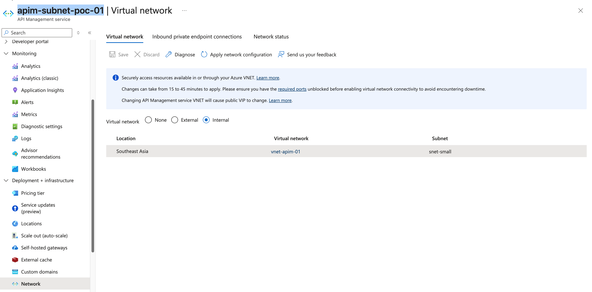

> **Current state:** APIM is on `vnet-apim-01` / `snet-small` (Internal mode, Southeast Asia)

---

## Step 2: Select the New Subnet

1. Click on the **Southeast Asia** row to edit the network configuration
2. In the right panel, change the **Subnet** dropdown to the new larger subnet (`snet-large`)
3. Leave **Virtual network** as the same VNet (`vnet-apim-01`)

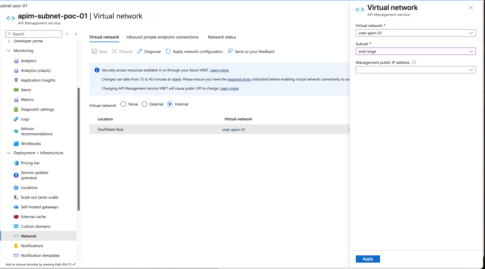

4. Click **Apply**

---

## Step 3: Verify the New Configuration

After applying, the portal shows the updated configuration with a warning:

> ⚠️ "To ensure your service can successfully update, please verify the new virtual network configuration before saving. Failure to do so may result in service disruptions."

Click the **Verify** button to run the VNet Verifier.

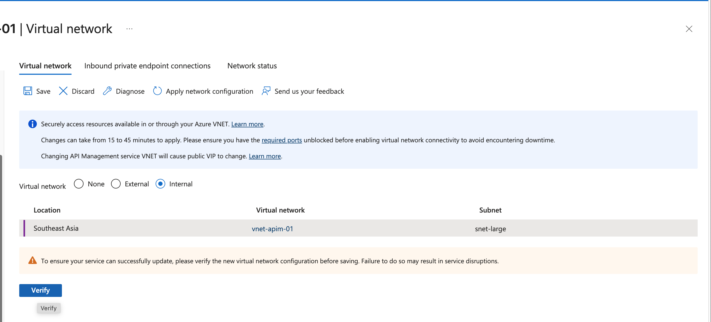

---

## Step 4: Review VNet Verifier Results

The VNet Verifier checks your new subnet for APIM compatibility. If there are issues, you will see **Critical** or **Warning** status:

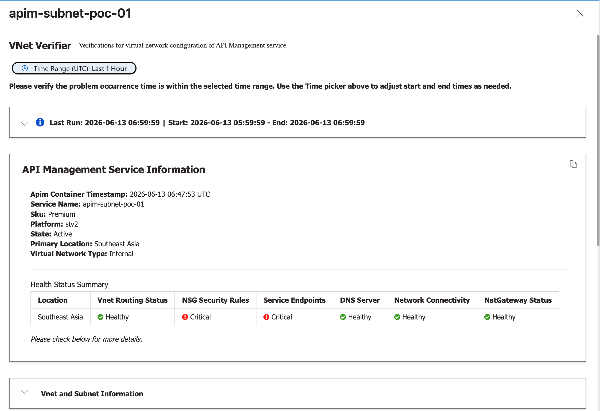

**Health Status Summary showing issues:**

| Check | Status | Meaning |
|-------|--------|---------|
| Vnet Routing Status | ✅ Healthy | Route tables are correct |
| NSG Security Rules | ❌ Critical | Missing required NSG rules |
| Service Endpoints | ❌ Critical | Service endpoints not enabled |
| DNS Server | ✅ Healthy | DNS resolution working |
| Network Connectivity | ✅ Healthy | Can reach Azure services |
| NatGateway Status | ✅ Healthy | NAT gateway configured correctly |

---

## Step 5: Fix Issue — NSG Not Associated

If the new subnet doesn't have an NSG attached, you'll see this error:

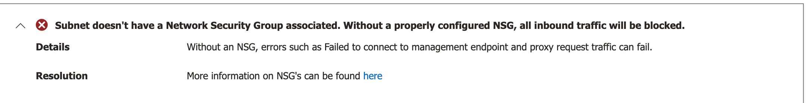

> ❌ **"Subnet doesn't have a Network Security Group associated. Without a properly configured NSG, all inbound traffic will be blocked."**

**Fix:**

```bash
az network vnet subnet update \
  --resource-group $RG \
  --vnet-name $VNET_NAME \
  --name $SUBNET_LARGE \
  --network-security-group $NSG_NAME
```

---

## Step 6: Fix Issue — Service Endpoints Not Enabled

The verifier shows which service endpoints are missing:

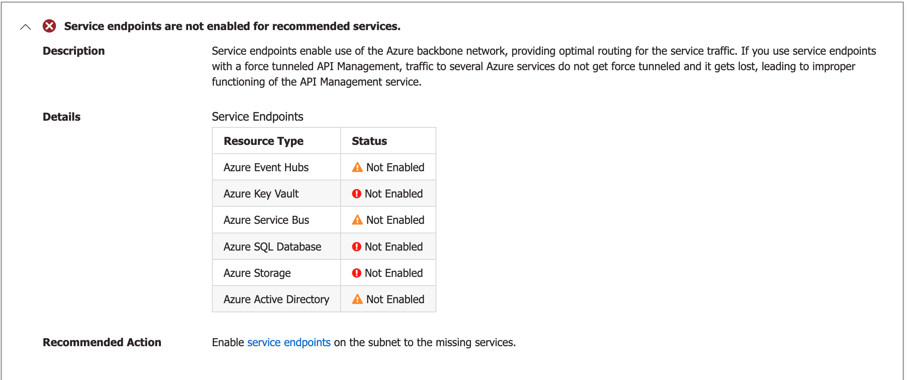

**Required Service Endpoints:**

| Service | Status | Required |
|---------|--------|----------|
| Azure Event Hubs | ⚠️ Not Enabled | If logging to Event Hub |
| Azure Key Vault | ❌ Not Enabled | **Yes** |
| Azure Service Bus | ⚠️ Not Enabled | If using Service Bus |
| Azure SQL Database | ❌ Not Enabled | **Yes** |
| Azure Storage | ❌ Not Enabled | **Yes** |
| Azure Active Directory | ⚠️ Not Enabled | Recommended |

**Fix — Enable all required service endpoints:**

```bash
az network vnet subnet update \
  --resource-group $RG \
  --vnet-name $VNET_NAME \
  --name $SUBNET_LARGE \
  --service-endpoints Microsoft.Storage Microsoft.Sql Microsoft.KeyVault \
    Microsoft.EventHub Microsoft.ServiceBus Microsoft.AzureActiveDirectory
```

---

## Step 7: Fix Issue — NSG Security Rules

The verifier may show failed security rule requirements:

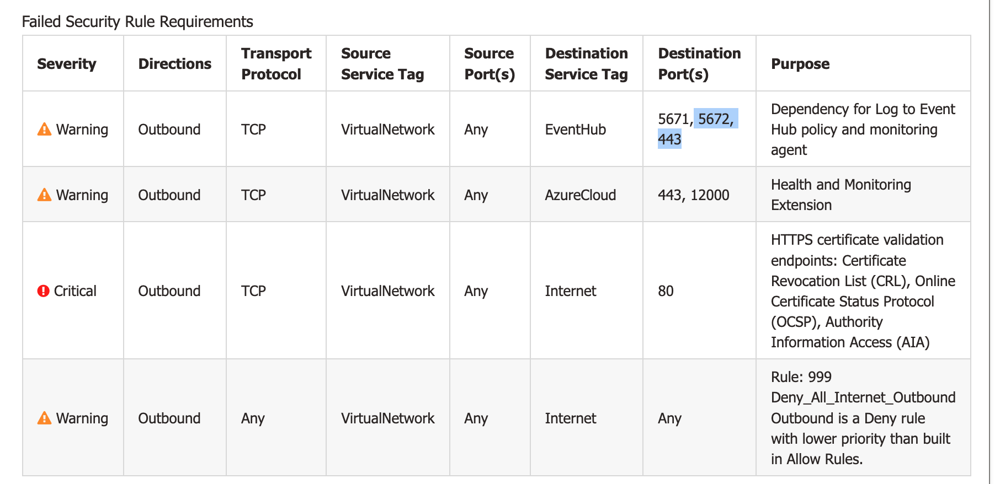

**Failed Security Rule Requirements:**

| Severity | Direction | Destination | Port(s) | Purpose |
|----------|-----------|-------------|---------|---------|
| ⚠️ Warning | Outbound | EventHub | 5671, 5672, 443 | Log to Event Hub policy and monitoring agent |
| ⚠️ Warning | Outbound | AzureCloud | 443, 12000 | Health and Monitoring Extension |
| ❌ Critical | Outbound | Internet | 80 | HTTPS certificate validation (CRL, OCSP, AIA) |
| ⚠️ Warning | Outbound | Internet | Any | Rule 999 Deny_All_Internet_Outbound is blocking |

**Fix — Add missing NSG rules (priority must be lower than Deny rule at 999):**

```bash
# Allow Event Hub outbound
az network nsg rule create \
  --resource-group $RG \
  --nsg-name $NSG_NAME \
  --name Allow-EventHub-Outbound \
  --priority 150 \
  --direction Outbound \
  --access Allow \
  --protocol Tcp \
  --source-address-prefixes VirtualNetwork \
  --source-port-ranges '*' \
  --destination-address-prefixes EventHub \
  --destination-port-ranges '5671 5672 443'

# Allow AzureCloud outbound (Health and Monitoring)
az network nsg rule create \
  --resource-group $RG \
  --nsg-name $NSG_NAME \
  --name Allow-AzureCloud-Outbound \
  --priority 160 \
  --direction Outbound \
  --access Allow \
  --protocol Tcp \
  --source-address-prefixes VirtualNetwork \
  --source-port-ranges '*' \
  --destination-address-prefixes AzureCloud \
  --destination-port-ranges '443 12000'

# Allow CRL/OCSP outbound (certificate validation, port 80)
az network nsg rule create \
  --resource-group $RG \
  --nsg-name $NSG_NAME \
  --name Allow-CRL-Outbound \
  --priority 170 \
  --direction Outbound \
  --access Allow \
  --protocol Tcp \
  --source-address-prefixes VirtualNetwork \
  --source-port-ranges '*' \
  --destination-address-prefixes Internet \
  --destination-port-ranges '80'
```

> ⚠️ **Note:** All Allow rules must have a priority **lower than 999** to be evaluated before the `Deny_All_Internet_Outbound` rule.

---

## Step 8: Confirm Service Endpoints Are Added

After applying the fixes, verify the service endpoints are enabled on the subnet:

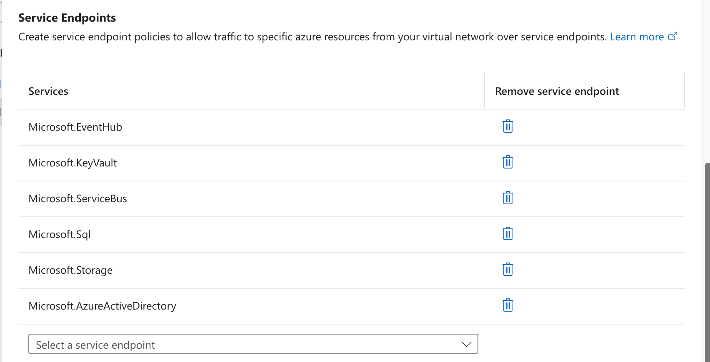

**Required service endpoints configured:**
- ✅ Microsoft.EventHub
- ✅ Microsoft.KeyVault
- ✅ Microsoft.ServiceBus
- ✅ Microsoft.Sql
- ✅ Microsoft.Storage
- ✅ Microsoft.AzureActiveDirectory

---

## Step 9: Re-run VNet Verifier — All Passed

After fixing NSG rules and service endpoints, click **Verify** again. All checks should now pass:

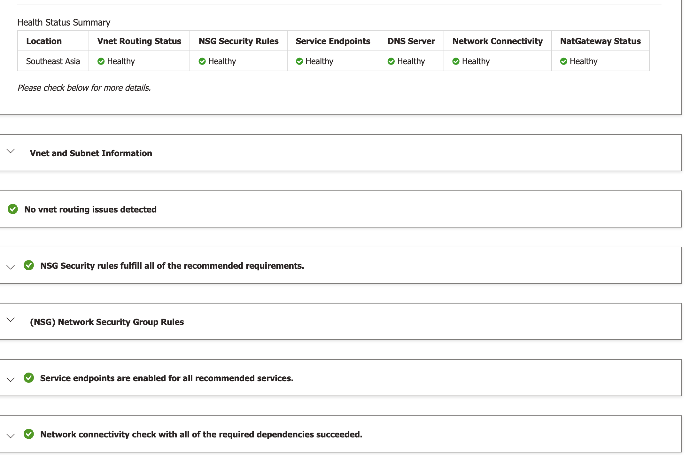

**Health Status Summary:**

| Check | Status |
|-------|--------|
| Vnet Routing Status | ✅ Healthy |
| NSG Security Rules | ✅ Healthy |
| Service Endpoints | ✅ Healthy |
| DNS Server | ✅ Healthy |
| Network Connectivity | ✅ Healthy |
| NatGateway Status | ✅ Healthy |

✅ **"NSG Security rules fulfill all of the recommended requirements."**
✅ **"Service endpoints are enabled for all recommended services."**
✅ **"Network connectivity check with all of the required dependencies succeeded."**

---

## Step 10: Save the Configuration

Once all verifications pass, click **Save** to start the subnet migration.

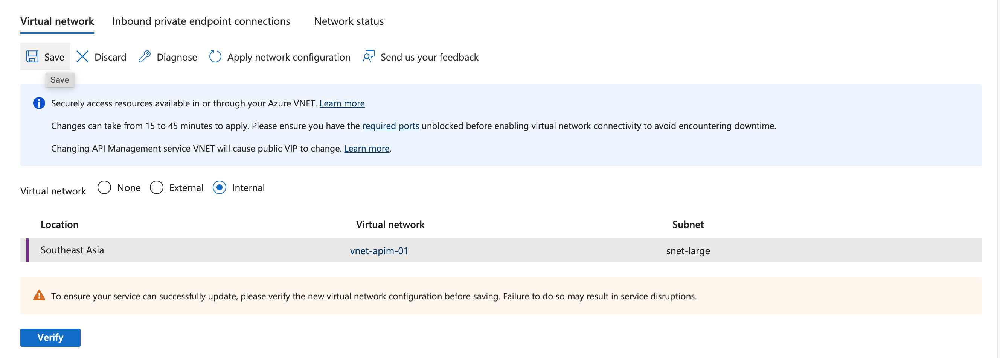

> ⚠️ **This triggers the migration. APIM will experience downtime (15-45 minutes).**

---

## Step 11: Migration In Progress

After saving, the portal shows a notification that the service is being updated:

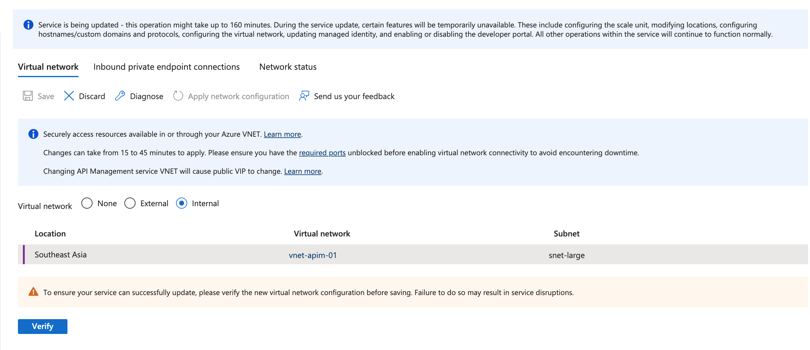

> ℹ️ **"Service is being updated - this operation might take up to 160 minutes. During the service update, certain features will be temporarily unavailable."**

The APIM network page shows the new subnet (`snet-large`) is now configured.

---

## Step 12: Verify Migration Complete

Once the operation completes, verify the APIM overview shows the new private IP on the larger subnet:

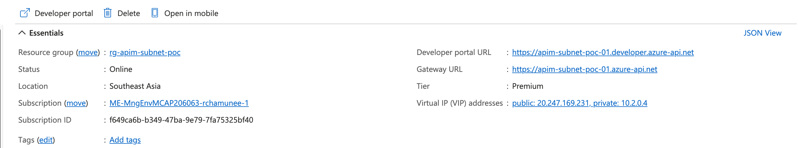

**Confirmed:**
- Status: **Online**
- Tier: **Premium**
- VIP: Public `20.247.169.231`, Private `10.2.0.4` (new subnet IP)
- Location: Southeast Asia

---

## Post-Migration Actions

After successful migration, complete these steps:

1. **Update DNS:** Point Private DNS zone to the new private IP (`10.2.0.4`)
2. **Update firewall rules:** Allow traffic to/from the new subnet range
3. **Update Application Gateway:** If applicable, update backend pool with new IP
4. **Scale APIM:** Now safe to scale to desired unit count
5. **Test APIs:** Verify API calls work from within the VNet

```bash
# Verify final state
az apim show --resource-group $RG --name $APIM_NAME \
  --query "{name:name, status:provisioningState, privateIPs:privateIPAddresses, subnet:virtualNetworkConfiguration.subnetResourceId}" \
  -o json
```

---

## Summary of Issues and Fixes

| Issue | Root Cause | Fix |
|-------|-----------|-----|
| NSG Security Rules ❌ Critical | NSG not attached to new subnet | `az network vnet subnet update --network-security-group` |
| Service Endpoints ❌ Critical | Service endpoints not enabled | `az network vnet subnet update --service-endpoints` |
| Deny_All_Internet ⚠️ Warning | Deny rule blocks APIM outbound | Add Allow rules with priority < 999 |
| CRL/OCSP ❌ Critical | Port 80 outbound blocked | Add Allow rule for Internet port 80 |

---

> [↑ Back to README](../README.md)
